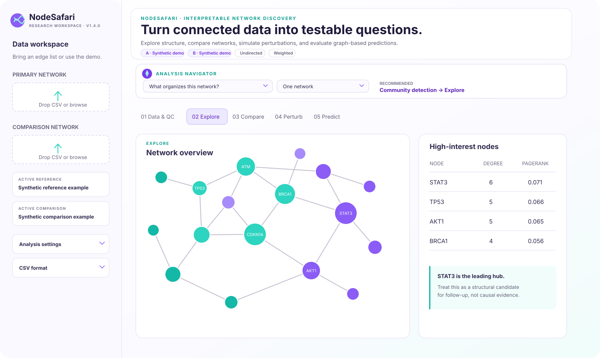

# NodeSafari

**Explore networks. Return with testable hypotheses.**

NodeSafari is an open-source Streamlit application and Python package for researchers who want to explore networks without assembling a custom graph-analysis pipeline. Rich-club organization is included, but the expedition goes further: discover structure, compare conditions, simulate perturbations, and use graph-based machine learning to prioritize follow-up questions. Biological interaction networks are the included example, not a restriction on the software.

> **Status:** v1.5 research release. Outputs are exploratory and do not establish causality.



## What researchers can do

| Question | NodeSafari workflow |
|---|---|
| Is my input ready to analyze? | Quality-control report for endpoints, loops, duplicates, weights, and connectivity |
| Which nodes and modules organize the network? | Centrality, communities, k-core structure, bridges, and global statistics |
| Are highly connected nodes unusually interconnected? | Binary or weighted rich-club analysis with null envelopes, empirical evidence, membership, and edge roles |
| What changes between control and disease? | Differential hubs, communities, and normalized rich-club curves |
| Which perturbation most disrupts organization? | Node deletion, edge deletion, and targeted-vs-random robustness screens |
| Which nodes occupy similar network roles? | Spectral node embeddings and nearest-node search |
| Can labels or missing interactions be predicted? | Cross-validated random forests and graph neural networks for node, link, and graph tasks |

## Analysis Navigator

Researchers do not need to know an algorithm name before starting. The guided
Analysis Navigator asks what they want to learn and what data they have, then
recommends:

- A primary method and complementary analyses
- The required inputs and whether the stated data are sufficient
- A sensible order in which to interpret the methods
- The exact NodeSafari workspace path
- A method-specific limitation or validation caveat

The navigator lives in the dedicated **Getting Started** application. It keeps the
recommendation and data-readiness guidance in one place, while the analysis tabs
remain focused on results. It also lists other questions supported by the selected
data profile.

## Easiest way to start: Docker

Docker is the simplest option because it includes Python and every required package.
You do **not** need to install Python or create a `.venv`.

1. Install and open [Docker Desktop](https://www.docker.com/products/docker-desktop/).
2. Open Terminal on macOS/Linux or PowerShell on Windows and run:

```bash
git clone https://github.com/adriennekline/nodesafari.git
cd nodesafari
docker compose up --build
```

3. Wait for Streamlit to start, then open **[http://localhost:8501](http://localhost:8501)**.

The first build may take several minutes. Keep the terminal open while using NodeSafari.
The application opens with synthetic control and disease-like networks, so you can
try every analysis without preparing a file.

To stop NodeSafari, press `Ctrl+C`, then run:


```bash
docker compose down
```

Uploaded data are processed locally and are not written to a persistent Docker
volume by this configuration.

**New to Docker or the command line?** Follow the complete
[beginner-friendly Docker guide](docs/GETTING_STARTED.md). It includes Windows,
macOS, and Linux instructions, downloading without Git, a first-analysis walkthrough,
updates, privacy notes, diagnostics, and troubleshooting.

## Alternative: run with local Python

```bash
git clone https://github.com/adriennekline/nodesafari.git
cd nodesafari
python -m venv .venv
source .venv/bin/activate  # Windows: .venv\Scripts\activate
pip install -r requirements.txt
streamlit run app.py
```

The `.venv` folder is created by the command above and is used only for the local
Python route. Docker has its own isolated environment and does not create a `.venv`.

## Input format

Upload a CSV edge list with `source` and `target` columns. `weight` is optional.

```csv
source,target,weight
TP53,MDM2,2.8
TP53,ATM,2.2
ATM,CHEK2,2.1
```

- Node identifiers may be gene, protein, metabolite, cell, brain-region, or other labels.
- Duplicate edges are combined by summing their weights.
- Self-loops and rows with missing endpoints are removed.
- Do not upload identifiable or otherwise restricted data to a public deployment.

Supervised ML inputs use two additional formats:

- **Node prediction:** a CSV with `node` and `label`; optional numeric columns are added as predictors.
- **Graph classification:** multiple edge-list CSVs plus a CSV with `graph` and `label`. The `graph` value must match the edge-list filename without `.csv`.

The app ships with synthetic node labels and a generated graph-classification dataset so every workflow can be explored immediately.

NodeSafari keeps demo and uploaded inputs separate. If you upload a reference
network without a comparison network, the comparison workspace remains disabled
until you upload network B. Likewise, demo node labels are never applied to an
uploaded network.

## Use the analysis package directly

```python
import pandas as pd
from nodesafari import graph_from_edgelist, perturbation_screen

edges = pd.read_csv("my_edges.csv")
graph = graph_from_edgelist(edges)
ranked_nodes = perturbation_screen(graph)
print(ranked_nodes.head())
```

## Scientific guardrails

NodeSafari deliberately labels its outputs as structural candidates or predictions. A high-impact node is not automatically a causal target, and a predicted link is not evidence that an interaction exists. See [Methods and interpretation](docs/METHODS.md) for assumptions and limitations.

## Self-hosting

The included container can run on a workstation, institutional server, or any Docker-compatible hosting platform. For remote deployment, place it behind your institution's authenticated reverse proxy and TLS termination. The app does not persist uploaded files, but deployment controls must still match the governance requirements for the data being analyzed.

## Included in v1.0

- Data upload and network QC
- Rich club, hubs, communities, k-core structure, bridges, and network statistics
- Network A/B comparison, differential hubs, communities, and rich-club curves
- Node and edge deletion screens plus targeted and random robustness analysis
- Spectral embeddings, cross-validated node prediction, learned link prediction, and graph classification

## Added in v1.1

- A two-layer graph convolutional network for transductive node classification
- A GCN graph autoencoder with a dot-product decoder for missing-link prediction
- A pooled two-layer GCN for whole-network classification
- Model selectors that retain class-balanced random forests as interpretable baselines
- Neural training-loss curves alongside held-out or out-of-fold performance metrics

The neural models are implemented with NumPy for compact, CPU-only operation. They
do not require PyTorch, specialized graph libraries, a GPU, or changes to the Docker
start command.

## Refined in v1.2

- Professional analysis workspace with a clearer header and numbered workflow navigation
- Self-contained Font Awesome icons with accessible hover and keyboard-focus explanations
- Action-specific hover help for settings, metrics, downloads, and ML model choices
- Visible input provenance, direction, and weighting context on every screen
- Downloadable analysis manifest for recording active inputs and run settings
- Compact sidebar with explicit active-data cards and organized analysis settings
- Guided empty states for comparison and supervised-learning workflows
- Strict separation between uploaded datasets and synthetic examples
- More consistent result introductions, metric definitions, research caveats, and exports

## Expanded in v1.4

- Binary and Opsahl-style weighted rich-club coefficients using degree or strength thresholds
- Configurable null-ensemble size, rewiring intensity, retained-node safeguard, and random seed
- Observed and null curves with a 95% null envelope, normalized enrichment, empirical p-values, and descriptive BH q-values
- Explicit flags for small rich sets and conservative exploratory-signal designation
- Threshold-specific rich-club membership plus rich-club, feeder, and local edge classification
- Role-colored network visualization and downloadable membership, edge-role, Methods, settings, and SVG files

## Simplified in v1.5

- Added six clear top-level application tabs: Getting Started, Data & QC, Explore, Compare, Perturb, and Predict
- Moved the complete Analysis Navigator, data-readiness guidance, and network summary into Getting Started
- Shortened the persistent header and removed duplicate workflow and metric elements from analysis screens
- Consolidated active data into one compact sidebar card and separated advanced settings by analysis type
- Replaced numbered navigation labels with direct, task-oriented application names

## Roadmap beyond v1.0

- Statistical testing for differential networks across replicated observations
- Temporal-network analysis
- Node metadata and pathway enrichment
- Heterogeneous and multilayer graphs
- Counterfactual analysis with uncertainty estimates

## Contributing

Method requests and contributions are welcome. Start with [CONTRIBUTING.md](CONTRIBUTING.md), which asks contributors to frame features around a scientific question and document assumptions.

## Attribution

```bibtex
@software{kline2026nodesafari,
  author    = {Kline, Adrienne},
  title     = {NodeSafari: Interpretable Network Discovery, Comparison, Perturbation, and Graph Machine Learning},
  year      = {2026},
  version   = {1.5.0},
  publisher = {Northwestern University},
  url       = {https://github.com/adriennekline/nodesafari},
  license   = {MIT}
}
```

Created by **Adrienne Kline** with **Northwestern University**. Licensed under the [MIT License](LICENSE). Citation metadata are provided in [CITATION.cff](CITATION.cff), with a ready-to-copy [BibTeX entry](CITATION.bib).

Interface icons use [Font Awesome Free 5.15.4](docs/THIRD_PARTY_NOTICES.md).
